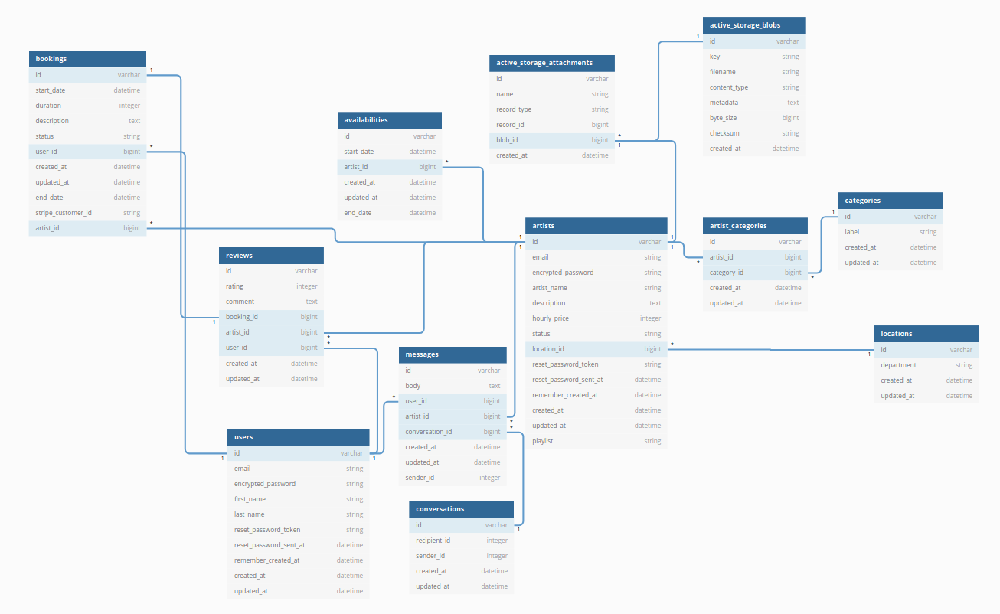

<!-- PROJECT LOGO -->
 

  <h1 align="center">The Get a Band Project</h1>

<!-- TABLE OF CONTENTS -->

  
Table of Contents

  <ol>
    <li>
      <a href="#about-the-project">About The Project</a>
      <ul>
        <li><a href="#built-with">Built With</a></li>
      </ul>
    </li>
    <li><a href="#user-journey">User journey</a></li>
    <li><a href="#main-features">Main features</a></li>    
    <li><a href="#contact">Contact</a></li>
  </ol>

<!-- ABOUT THE PROJECT -->
## About The Project

Get a Band is a platform connecting engaged couples planning their wedding with musicians, bands and DJs eager to play for their big day. **Find the app in production on Heroku [here](https://get-a-band.herokuapp.com/)!**

Welcome to the Get A Band Platform!

### Built With

#### Languages and frameworks
* [Ruby - ver. 2.7.1](https://ruby-doc.org/core-2.7.1/)
* [Ruby on Rails - ver. 5.2.4](https://rubyonrails.org/)
* [JavaScript](https://www.ecma-international.org/publications-and-standards/standards/ecma-262/)
* [Bootstrap](https://getbootstrap.com)

#### PostGreSQL database
The detailed database schema can be visualized [here](https://dbdiagram.io/d/605db0ddecb54e10c33d6365) on DBDiagram, with a preview below.

#### Front-end
Design of the graphic identity of the brand (colors, typographies...) and adaptation of a CSS overlay (UI Kit Bootstrap) according to it. Development of Javascript scripts for the animation of the site, in particular for the animation of the search filters.

#### Back-end
Fundamentals : Ruby and Ruby on Rails, Devise identification gem, Stripe API, Forest Admin interface, basic artist filtering system by event date.
Bonus : embedded Spotify player to integrate music on the artists' profiles, implementation of a review system, implementation of a private message chat feature, pagination of available artists, advanced filtering system by artist categories (with several options) and location choice, added Ajax routes for certain actions e.g. pagination, filtering and booking update.
##### Ruby Gems, APIs, and other tools
* [Font Awesome](https://fontawesome.com)
* [Stripe](https://stripe.com/fr) and the [Stripe Gem](https://github.com/stripe/stripe-ruby)
* [MailJet](https://fr.mailjet.com/) 
* [Devise and its Gem](https://github.com/heartcombo/devise)
* [Amazon Web Storage and its Gem](https://github.com/aws/aws-sdk-ruby)
* [Faker Gem](https://github.com/faker-ruby/faker)
* [Pagy Gem](https://github.com/ddnexus/pagy)
* [Forest Admin and its Gem](https://www.forestadmin.com/)
* [i18n Gem](https://github.com/ruby-i18n/i18n)
* [Rubocop Gem](https://github.com/rubocop/rubocop)
* [Simple Calendar Gem](https://github.com/excid3/simple_calendar)

<!-- USER JOURNEY -->
## User Journey
### On the artists' side
The artist creates an account with an e-mail and password, then fills in their profile, which will include essential information such as
* Their artistic name
* A short description of their artistic approach, including the music genre they offer and examples of tracks or references
* Their hourly rate
* Pictures of past gigs

Their profile gets enriched afterwards as customers leave reviews on the platform. The artist's profile also displays an availability calendar that is updated according to the bookings.
The artist can follow their past and future reservations on their administrator interface. When a bride & groom make a reservation request, the artist is informed and must validate or refuse the pending reservation from their interface. An artist can cancel a reservation up until one week until the event.

### On the groom and bride's side
The bride and groom create an account with an email and password, then are invited to fill out a questionnaire about their needs (date and place of the wedding, what style of music they are looking for, for what part of the day...). The results of their artist search are filtered accordingly. They choose an artist that interests them and can directly send a booking request, with payment of a deposit.
The bride and groom can cancel a reservation up until one week until the event.
Once the booking is complete, the bride and groom can leave a review and a note on the artist's performance, which will then appear on their profile.

<!-- MAIN FEATURES -->
## Main Features
### For all
* As a visitor, I can get information on the purpose and the functionalities of the website (i.e. there is a clear landing page)
* As a visitor, I can browse through the artists
* As a visitor, I can see the artists' individual pages, which include reviews and suggestions of other artists in the same geographical area
* As a visitor, I cannot send requests to artists
* As a visitor, I can log in and sign up on an account on the website.

### For registered users
* As a registered user, I can do anything a visitor can do
* As a registered user, I have access to a dashboard section where I can manage all my information and bookings
* As a registered user, I can change my account's basic information
* As a registered user, I can choose my event's start date and see available artists
* As a registered user, I can choose my event's location and see matching artists
* As a registered user, I can choose one or several music genres (strict or inclusive) and see matching artists
* As a registered user, I can combine the latter three filters as I please in my query
* As a registered user, I can send a booking request to an artist and pay for it online
* As a registered user, I can cancel a booking request or an approved booking up to a week before my event, and be refunded
* As a registered user, I can communicate via a private chat with the artists I have bookings and booking requests with
* As a registered user, I can leave a review on an artist when my event with them is complete

### For registered artists
* As a registered artist, I can do anything a visitor can do
* As a registered artist, I have access to a dashboard section where I can manage all my information, bookings and availabilities
* As a registered artist, I can change my account's basic information
* As a registered artist, I can set my profile to display details about my band including a sample Spotify playlist
* As a registered artist, I can add pictures and an avatar to my profile, as well as delete them
* As a registered artist, I can set my availabilities on the "My Calendar" page
* As a registered artist, I can approve or deny bookings requests I receive from users
* As a registered artist, I can communicate via a private chat with the users I have bookings and booking requests with
* As a registered artist, I can cancel a booking request or an approved booking up to a week before my event
* As a registered artist, I can see the reviews I have been left on my dashboard

### Other
* There is an admin platform, managed through the ForestAdmin API. The website's admin manually approves each artist who signs up. Artists are not visible on the public artist index page until they have been approved by the admin. The admin approves artists who have completed their profile with legitimate information (e.g. a real description).

<!-- CONTACT -->
## Contributors listed in alphabetical order
* [Ariane](https://github.com/arejl)
* [Arnaud](https://github.com/JAG-ROSA/)
* [Caroline](https://github.com/Caro407)
* [Martin](https://github.com/Martinfzz)